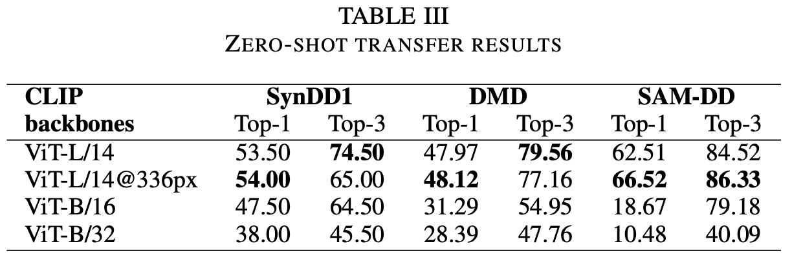

# [Vision-Language Models can Identify Distracted Driver Behavior from Naturalistic Videos](https://arxiv.org/abs/2306.10159)  

Here is the codebase for running the frame based DriveCLIP framework. The summary results on different distracted driving datasets are:

 

### Datasets:
| Dataset  | Modality | # of Classes | Link | # of training samples
|----------|----------|----------|----------|----------|
| DMD | RGB | 10  | [link](https://dmd.vicomtech.org/) | 78917(per fold)
| StateFarm | RGB | 10  | [link](https://www.kaggle.com/competitions/state-farm-distracted-driver-detection/data) | 20204 (per fold)
| SynDD1 | RGB | 18 | [link](https://doi.org/10.1016/j.dib.2022.108793) | 4404 (1fps, dashboard)
| SAM-DD | RGB | 10 | [link](https://yanghh.io/SAM-DD/) | 36839 (28 drivers)


### Details:
1. The frame-based CLIP model was trained to predict the distracted driving actions for each frame. So, while doing the inference, the model will assign each frame with a predicted action label and the confidence score (probability score for that certain predicted action label).

For training on SynDD1 dataset, we used 8 distracted action classes. They (class-ID & class label) are as follows:
 ```
0 "driver is adjusting his or her hair while driving a car"
1 "driver is drinking water from a bottle while driving a car"
2 "driver is eating while driving a car"
3 "driver is picking something from the floor while driving a car"
4 "driver is reaching behind to the backseat while driving a car"
5 "driver is singing a song with music and smiling while driving"
6 "driver is talking to the phone on hand while driving a car"
7 "driver is yawning while driving a car"
```
 
Therefore, the model can predict only these 8 classes. Also, there are some variants of the model weights. (ViT-L/14 backbone based model gives the best result)


2. Data folder structure (SynDD1) should be like this: [0-7] action classes on SynDD1 dataset

```
     ./data
      ├── syn1fps_dash
      │   ├── 0
      │   ├── 1
      │   ├── 2
      │   ├── 3
      │   ├── 4
      │   ├── 5
      │   ├── 6
      │   └── 7
      ├── syn5fps_dash
      │   ├── 0
      │   ├── 1
      │   ├── 2
      │   ├── 3
      │   ├── 4
      │   ├── 5
      │   ├── 6
      │   └── 7
```

3. The subject splitting profile files are saved in `driverprofile` folder. For SynDD1 see `subject_splitting_profile.json` and for StateFarm see `driver_img_list.csv`.

```json
"fold0": {
    "train": [
        "35133",
        "65818",
        "42271",
        "19332",
        "79336",
        "56306",
        "25470",
        "24491",
        "76803",
        "24026"
    ],
    "val": [
        "49381",
        "38058"
    ],
    "test": [
        "76189",
        "61597"
    ]
}
```
## Steps to run the inference on the video file:

1. Download the video and save it in .MP4 format in a video/ folder
2. Create a conda environment and run the ``` requirements.txt``` file
3. Open ```inference.py``` and specify the CLIP backbone (model_name) and FPS (default=1FPS). Then run the python file from terminal by following the command:
        ```python inference.py --video video_path –frame Extracted_frame_directory_path```
For example:
        ```python inference.py –-video video/Dashboard_user_id_13522_NoAudio_5.MP4 --frame frame_folder```

5. Prediction results will be stored in a .json file named ```frame_prediction.json``` This file consists of the following format:

        ``` { frame_01_path: {prediction label, [list of prediction prob. scores]}, 
              frame_02_path: {prediction label, [list of prediction prob. scores]}, ... } ```


## Steps to run frame-based experiments:
1. Set up the conda environment and run requirements.txt files from CLIP main repo
2. Upload .mp4 video files into synvid folder (see `synvid/video_list.csv`) and run the `frame.py` to extract frames at different fps. Store the frames in [0-7] folder structure shown above.
3. Check the driver profile folder to prepare the driver split
3. Feed the frames to CLIP model 
4. run the run files 

### Repo for model comparison: [Link](https://github.com/suzoosuagr/CLIP_Zahid.git)
### Repo for VideoCLIP: [Link](https://github.com/jiajingchen113322/DeepInsigth.git)
